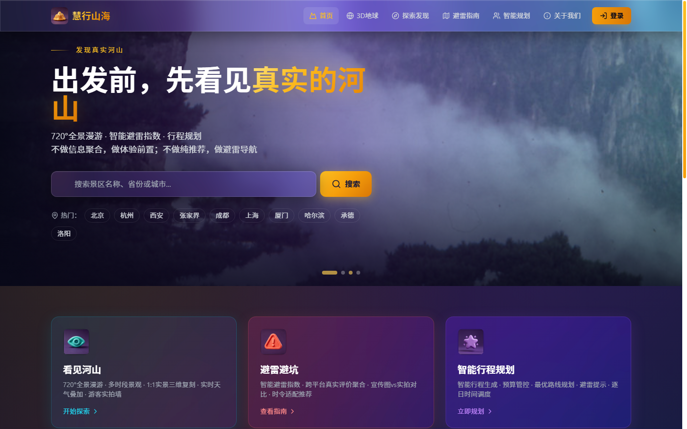
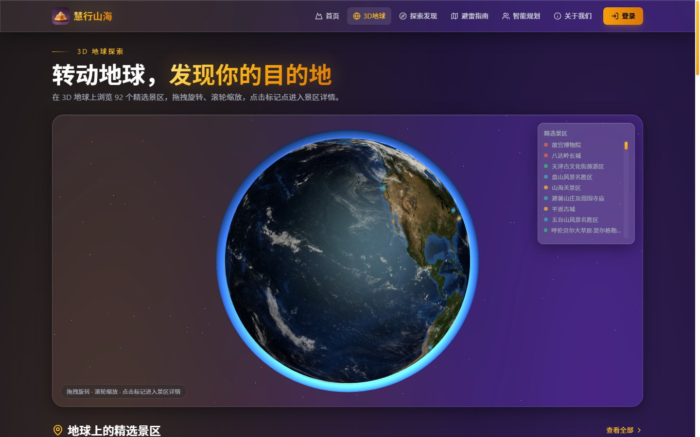
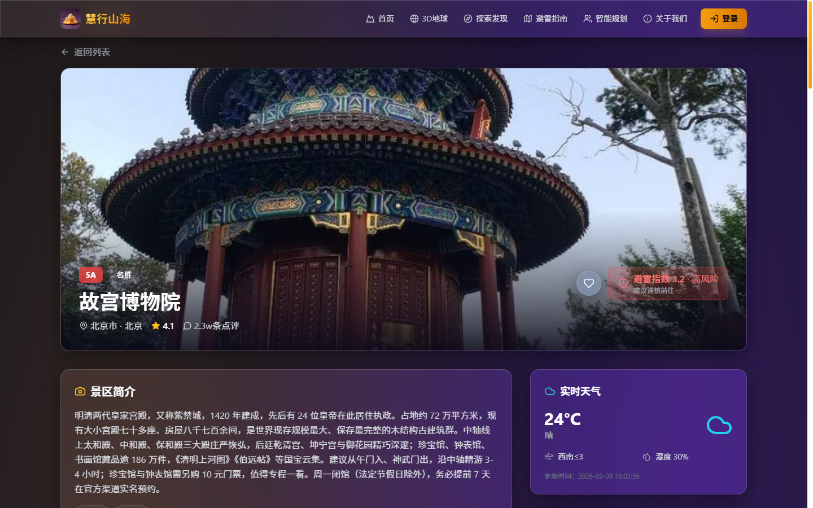
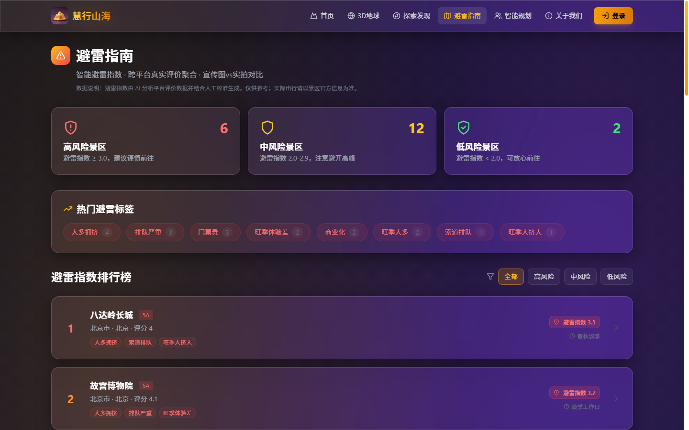

# 慧行山海 — 基于 AI 与电子地图的一站式旅游规划导览平台

> 出发前，先看见真实的河山；出发后，不踩任何一个雷。

**在线体验**：[https://mw2wbyys6t-sudo.github.io/huixing-shanhai/](https://mw2wbyys6t-sudo.github.io/huixing-shanhai/)
**API 文档**：[https://huixing-shanhai.onrender.com/docs](https://huixing-shanhai.onrender.com/docs) ｜ **演示账号**：`13800138000` / `123456`

> 💡 免费云部署：前端托管 GitHub Pages（全球 CDN 永不休眠），后端托管 Render 免费实例（15 分钟无访问休眠，首次打开约需 50 秒唤醒，之后流畅）。

---

## 项目简介

慧行山海是一个基于 AI 与电子地图的一站式旅游规划导览平台，围绕「**看见河山 → 智能规划 → 出行辅助 → 内容社区**」构建完整闭环：

- 🗺️ **看见河山**：350 个国内外精品景区（全国 5A 覆盖 + 世界五大洲）· 3D 地球探索 · 720° 全景漫游 · 实时天气 · 周边美食 · 游客实拍墙
- ⚡ **避雷避坑**：AI 避雷指数（NLP 情感分析）· 宣传图 vs 实拍对比 · 高风险景区提醒
- 🧭 **智能规划**：LangGraph 多 Agent 工作流 · **跨城交通方案** · 逐日行程 · 预算管控 · 质量评估自动修订
- 💬 **内容社区**：游记/攻略发布 · 评论点赞互动 · **实时聚合旅游资讯**（天气/社区/评价/避雷四路聚合）

**数据立场**：不编造任何评价与数据——评价来自站内真实统计，美食来自高德实时 POI，视频以 B站官方播放器嵌入并强制标注来源与作者，图片来自 Wikimedia Commons，外部数据不可用时诚实标注。

## 界面预览

| 首页 | 3D 地球 |
|---|---|
|  |  |

| 景区详情（故宫） | 避雷指南 |
|---|---|
|  |  |

## 已实现功能

### 前端（Next.js 14 + TypeScript + Tailwind CSS）
- **首页**：Hero 轮播、站内搜索、精选推荐
- **探索发现**：搜索（300ms 防抖 + 竞态防护）、省份/类型筛选、分页
- **景区详情**：图片轮播、景区实景环视（拖拽 + 时段光影）、实时天气、**门票费用参考与交通建议**、AI 避雷分析（基于真实评价数据）、游客评价、UGC 实拍墙（上传/点赞）、周边美食（高德 POI）、宣传视频（B站官方播放器+来源标注）、同省份推荐
- **游记社区**：游记/攻略发布（关联景区联想）、列表筛选排序、详情阅读与点赞、评论互动
- **旅游资讯**：实时聚合热门目的地天气（高德）、最新社区内容、最新评价与避雷提醒
- **避雷指南**：风险分级统计、避雷排行榜、避雷知识科普
- **智能规划**：LangGraph 多 Agent 工作流可视化（SSE 实时进度）、**跨城交通方案**、AI 行程输出渲染、导出/分享
- **AI 助手**：DeepSeek 驱动对话、多会话管理（本地持久化）、后端在线状态检测
- **3D 地球**：React Three Fiber 地球 + 景区标记（按避雷指数着色）+ 飞行路线
- **账号体系**：注册/登录（密码 + 验证码）/忘记密码，全站登录态展示与登出
- **监控面板**：工作流执行日志、质量评分统计
- SEO（sitemap/robots/OG 元信息/favicon）、全局错误与空状态、图片加载兜底

### 后端（FastAPI + SQLAlchemy + LangGraph）
- 景区 API：列表/筛选/分页/搜索/推荐/避雷指数/门票与交通
- 高德天气：地理编码 → 实时天气；周边美食：高德 POI 检索
- 认证：PBKDF2 密码哈希、HMAC-SHA256 签名 token、验证码（演示模式）
- AI：DeepSeek 对话、避雷情感分析、LangGraph 多 Agent 工作流（意图解析 → 4 路并行分析 → 行程汇聚 → 质量评估 → 自动修订）
- 内容社区：游记/攻略发布、点赞、评论（限流保护）
- 实时资讯：天气 + 社区 + 评价 + 避雷四路聚合（10 分钟缓存）
- UGC：照片上传（类型白名单 + 大小限制 + 魔数校验）、评价、点赞
- 监控：工作流执行日志落库

## 技术栈

| 层 | 技术 |
|---|---|
| 前端 | Next.js 14、TypeScript、Tailwind CSS、React Three Fiber、Lucide |
| 后端 | FastAPI、SQLAlchemy、LangGraph、httpx、DeepSeek API |
| 地图 | 高德 JS API 2.0（地图/路线）、高德 Web API（天气/POI） |
| 数据 | SQLite（开发）/ PostgreSQL（生产可配）、JSON 景区库 |
| 部署 | GitHub Pages（前端）+ Render（后端），render.yaml 蓝图一键部署 |

## 快速开始

### 环境要求
- Python 3.11+（仓库内置 `.python-version` = 3.12.6）
- Node.js 18+（推荐 20）

### 1. 配置密钥

```bash
cd backend
cp .env.example .env   # 填入你自己的高德/DeepSeek 密钥
```

> ⚠️ 密钥只保存在 `backend/.env`（已被 .gitignore 排除），切勿提交到版本库或写入源码。
> 未配置密钥时系统自动降级：景区浏览等核心功能不受影响，天气/美食/AI 给出明确提示。

### 2. 一键启动（Windows）

双击 `start.bat`，或按下方手动启动。

### 3. 手动启动

```bash
# 后端（端口 8000）
cd backend
pip install -r requirements.txt
uvicorn app.main:app --reload --port 8000

# 前端（端口 3000）
cd frontend
npm install
npm run dev
```

- 前端：http://localhost:3000
- 后端 API 文档：http://localhost:8000/docs
- 后端地址可通过 `frontend/.env.development` 的 `NEXT_PUBLIC_API_URL` 配置

### 演示账号

手机号 `13800138000` / 密码 `123456`（或自行注册；验证码为演示模式，会直接显示在页面上）

## 云端部署

仓库提供两套零配置部署方案：

| 平台 | 配置文件 | 说明 |
|---|---|---|
| GitHub Pages | `.github/workflows/nextjs.yml` | 前端静态站自动构建部署（本仓库已在用） |
| Render | `render.yaml` | 后端 API + 备选前端方案，Blueprint 一键创建 |

后端已配置保活工作流（`.github/workflows/keep-warm.yml`，每 10 分钟 ping 一次），消除免费实例冷启动。

## API 接口一览

```
GET  /api/spots                      景区列表（分页/筛选）
GET  /api/spots/{id}                 景区详情
GET  /api/spots/search?q=            搜索
GET  /api/spots/{id}/avoid           避雷指数
GET  /api/spots/recommend            推荐
GET  /api/spots/{id}/food            周边美食（高德 POI）
GET  /api/food/city?city=            城市美食
GET  /api/news                       实时聚合旅游资讯
GET  /api/notes                      游记列表
POST /api/notes/submit               发布游记/攻略
GET  /api/notes/{id}                 游记详情
POST /api/notes/{id}/like            游记点赞
POST /api/notes/{id}/comments        游记评论
GET  /api/weather?city=              天气（高德）
GET  /api/stats                      统计信息
POST /api/auth/send-code             发送验证码
POST /api/auth/login                 密码登录
POST /api/auth/login/code            验证码登录
POST /api/auth/register              注册
POST /api/auth/reset-password        重置密码
GET  /api/auth/user                  当前用户
POST /api/auth/logout                登出
POST /api/chat                       AI 对话（DeepSeek）
POST /api/avoid/analyze              AI 避雷分析
GET  /api/avoid/batch                批量避雷分析结果
POST /api/workflow/plan              多 Agent 行程规划
POST /api/workflow/langgraph         LangGraph 工作流（等价）
POST /api/workflow/stream            工作流 SSE 流式进度
GET  /api/workflow/logs              工作流执行日志
POST /api/upload/photo               上传实拍（jpg/png/webp ≤10MB）
GET  /api/ugc/photos/{spot_id}       实拍列表
POST /api/ugc/like/{review_id}       点赞
POST /api/reviews/submit             提交评价
GET  /api/reviews/list/{spot_id}     评价列表
```

## 数据说明

- `data/scenic_spots.json`：350 个精品景区权威数据（全国 5A 覆盖 + 国际知名景区；坐标/评分/避雷指数/门票参考/交通建议），**为避免 LLM 输出趋同，avoid_index 以本文件为唯一权威**
- `data/scenic_videos.json`：92 条景区宣传视频元数据（B站官方播放器嵌入，标注来源与作者）
- `data/avoid_analysis.json`：DeepSeek 批量生成的避雷分析（关键词/标签/建议），接口层动态合并景区内置避雷数据覆盖全部 350 个景区
- `backend/scripts/batch_avoid_analysis.py`：重跑批量分析（自动对齐权威值，不会反向覆盖）
- `frontend/lib/scenic_data.json`：前端本地副本（后端不可用时自动回退，保证纯静态部署可浏览）

## 安全说明

- 所有密钥通过 `backend/.env` 注入，源码与 `.env.example` 中无真实密钥
- 密码使用 PBKDF2-SHA256 加盐哈希存储，旧明文数据在登录时自动透明升级
- 上传接口：扩展名白名单 + 10MB 上限 + 文件魔数校验 + 服务端生成文件名
- 所有列表接口分页参数有上下限，工作流反馈轮次限制 0-3（防 LLM 调用放大）
- CORS 白名单可配置（默认仅放行本地前端）
- 若密钥曾在历史版本中泄露过，请到各平台控制台重置

## 设计原则

1. **体验前置**：3D 地球与 720° 全景，未出发先看见
2. **AI 避雷**：结构化评估，一眼判断值不值得去
3. **真实可信**：不编造评价与数据——AI 分析基于真实输入，无数据时诚实提示
4. **分层解耦**：前后端分离，前端可静态导出并在无后端时优雅降级

## 许可证

MIT License
